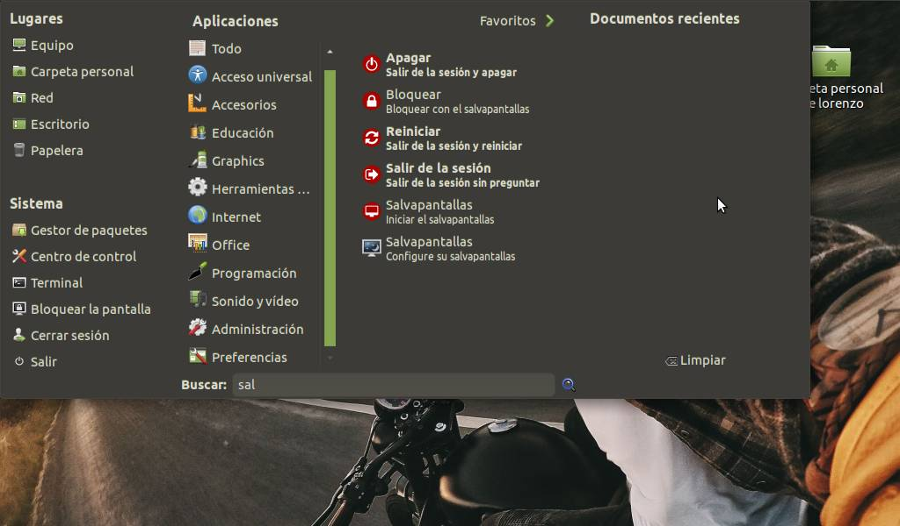

# Power Commands

Power Commands are a set of launcher that help you to run elementary tasks in your desktop environment. There are launchers for,

* **Suspend**. Suspend mode. A special low power mode, that preserves the content of RAM while converving power.
* **Hibernate**. Hibernate mode. Everything is saved. There is not power consumption. Not work in all the devices.
* **Logout**. Exit from current session.
* **Restart**. Restart the device.
* **Shutdown**. Power off the device.
* **Screensaver**. Launch the screensaver.
* **Lock**. Lock the device. You must enter the password to re-enter in the current session.
* **Kill**. Kill a graphical application. You must see a cross, click with it in the app you want to end.



## Compatibility

**Power Commands** works with these desktop environment,

* GNOME
* MATE

## Download

To get source code, clone the repository:

```
git clone 
```

## Installation

To install in Ubuntu, Linux Mint, etc, run these commands,

```
$ sudo add-apt-repository ppa:atareao/atareao
$ sudo apt-get update
$ sudo apt-get install power-commands
```

You can get more information in spanish in [atareao.es](https://www.atareao.es/apps/power-commands-o-como-mejorar-tu-productividad-en-ubuntu/)